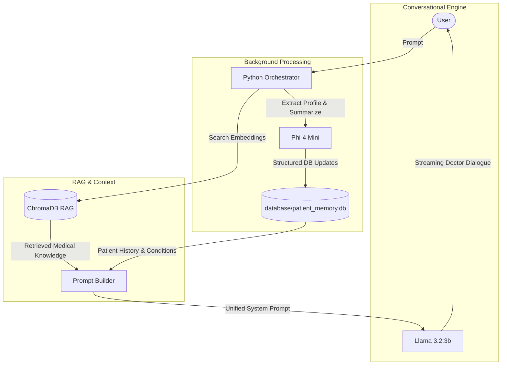

# Multi-Model Orchestration Architecture

This document outlines the roles, responsibilities, and design rationale behind the multi-model AI physician architecture.

---

## Architecture Overview

The system uses a decoupled multi-model architecture where conversational reasoning is separated from structured background data processing. 

---

## Model Responsibilities

### 1. `llama3.2:3b` — Conversational AI Physician
* **Primary Role**: Conversational reasoning and real-time patient interaction.
* **Responsibilities**:
  * **Doctor Dialogue**: Generates natural, empathetic, and professional physician assistant responses.
  * **Clinical Reasoning**: Analyzes patient symptoms using the retrieved RAG context, patient profile, and conversation history.
  * **Evidence-Based Guidance**: Recommends self-care, over-the-counter options, and highlights red-flag warning signs conditionally.
  * **Real-Time Streaming**: Operates with token-by-token streaming (`stream=True`) for low-latency user feedback.

---

### 2. `phi4-mini:latest` — Clinical Data Extractor & Summarizer
* **Primary Role**: Background structured information extraction and context management.
* **Responsibilities**:
  * **Profile Extraction**: Parses the latest user turn into clean, validated JSON covering:
    * Metadata (`name`, `age`, `gender`).
    * Lists (`allergies`, `medications`, `surgeries`, `family_history`).
    * Disease tracking (`active_conditions`, `suspected_conditions`, `resolved_conditions`).
  * **Diagnostic Confidence Assignment**: Assigns diagnostic confidence (`confirmed: true/false`) to extracted medical conditions.
  * **Context Summarization**: Periodically condenses older dialogue turns into concise clinical summaries when conversation history grows long.
  * **JSON Enforcement**: Operates in strict JSON mode (`format="json"`) to ensure reliable Python parsing.

---

## Architectural Benefits

1. **Separation of Concerns**: Prevents conversational degradation by freeing the doctor model from strict schema formatting constraints.
2. **Speed & Latency Optimization**: User-facing responses stream immediately while structured extraction runs asynchronously in Python.
3. **Medical Accuracy**: Keeps the patient memory updated without introducing hallucinated diagnoses into `active_conditions`.
